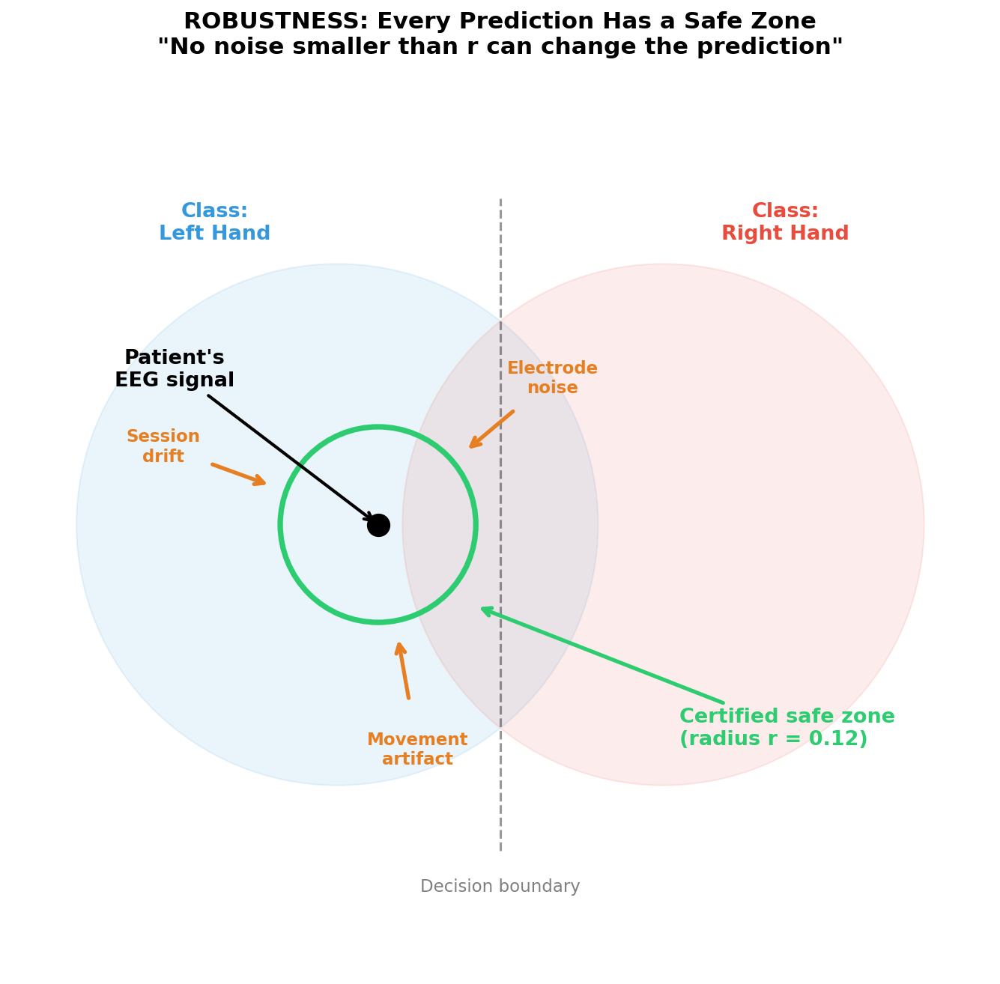
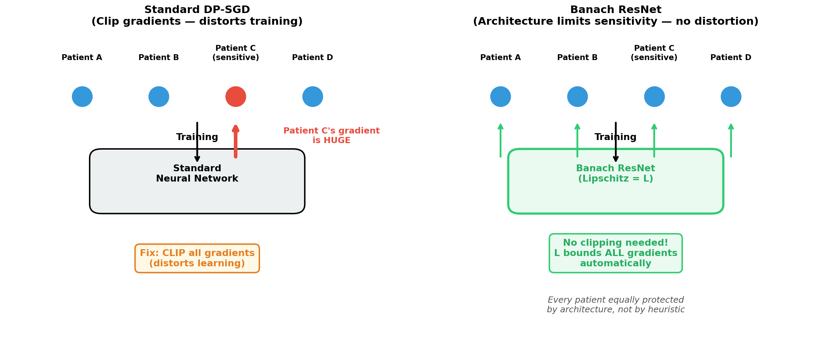
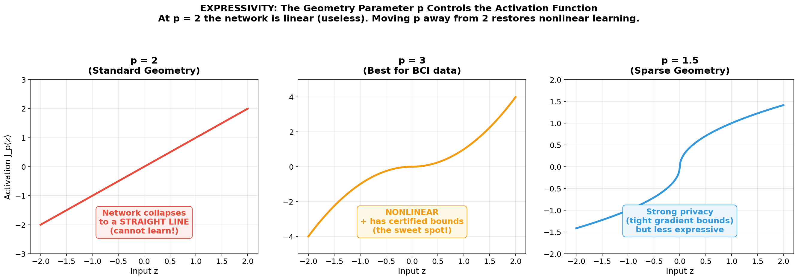
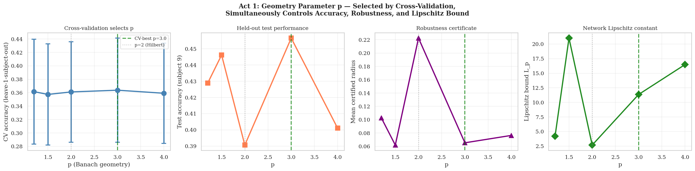
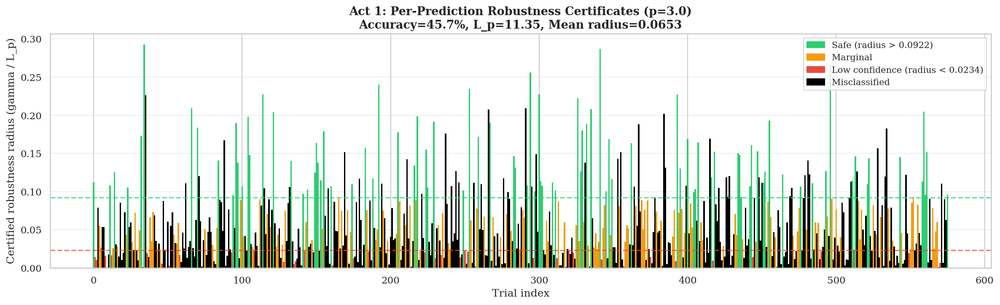
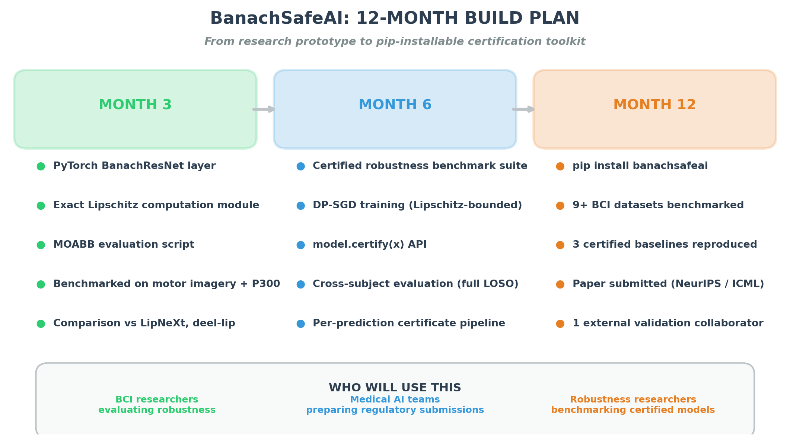
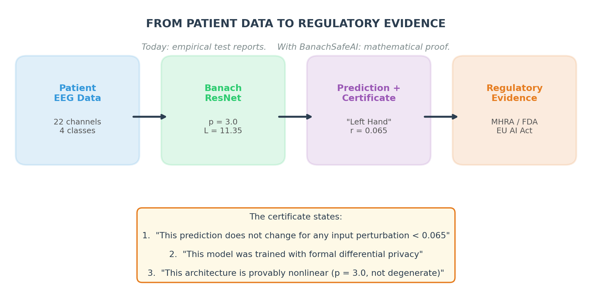

# BanachSafeAI

## Certified Neural Networks via Banach Geometry

A neural network architecture -- the Banach ResNet -- where robustness, privacy, and expressivity are structural consequences of a single mathematical choice: the geometry of l^p Banach spaces. A single computable quantity (the Lipschitz constant) jointly governs all three properties and is computed exactly from the architecture's weights.

---

### Quick Links

| Resource | Description | Link |
|----------|-------------|------|
| Project Explainer (2 min 37 sec) | Overview of the architecture and safety certificates | <a href="video/banachsafeai_explainer.mp4" target="_blank">Watch</a> |
| Interactive Demo (Colab) | Runs in ~2 min on CPU, no installation needed | <a href="https://colab.research.google.com/drive/11xAXxd9RqQm0abBs7k6Y-FCFksoA6_lS?usp=sharing" target="_blank">Open in Colab</a> |
| MOABB Baseline Report (PDF) | Full LOSO comparison on BNCI2014-001 (9 subjects) | <a href="reports/banachsafeai_moabb_baseline_report.pdf" target="_blank">Read report</a> |

---

## 1. The Problem

Neural networks deployed in safety-critical settings -- medical devices, brain-computer interfaces (BCIs, systems that decode neural signals to control devices such as wheelchairs and exoskeletons), clinical decision support -- must satisfy three properties simultaneously: **robustness** (bounded sensitivity to input perturbations), **privacy** (formal protection of patient data), and **expressivity** (sufficient capacity to model complex signals). Today, these are treated as separate problems with separate tools, each providing only empirical guarantees.

To our knowledge, no existing neural network architecture provides a single architecture-level quantity that jointly governs all three from its mathematical structure.

This gap is now a regulatory problem. Three frameworks converging in 2026 require robustness evidence for AI in medical devices: the EU AI Act (Article 15, enforcement August 2026), the UK MHRA AI medical device framework, and the US FDA Total Product Life Cycle guidance. Existing certified methods rely on probabilistic smoothing or loose bounds rather than architecture-level closed-form certificates, and regulatory submissions rely predominantly on empirical testing.

Empirical testing has a fundamental limitation: it can only cover attacks that have already been conceived. The set of benchmarks is necessarily finite and selected by the developer. A mathematical certificate, by contrast, covers all perturbations within the certified radius -- including attacks that have not yet been invented. It cannot be selectively reported because the bound is a property of the architecture, not a choice of test suite.

---

## 2. The Key Idea: The Lipschitz Constant

The Lipschitz constant L measures the maximum rate at which the network's output can change relative to its input. If the input changes by delta, the output changes by at most L x delta.

In standard neural networks, this quantity is unknown -- it must be estimated empirically or bounded loosely. In the Banach ResNet it is computed exactly from the architecture's weights:

> **L_p = product over all layers of (1 + eta_k x ||A_k||)**

Every term in this product is known. There is no approximation. Because each linear layer is spectrally normalised (||A_k|| <= 1), the Lipschitz constant simplifies to L_p = product of (1 + eta_k) in the experiments.


**Left:** A standard neural network can change its output dramatically in response to a tiny input change. **Right:** The Banach ResNet has a known Lipschitz constant. Its output is mathematically confined within a cone -- it cannot change faster than L times the input change.

This single number is the key to all three safety properties.

---

## 3. Three Safety Properties from One Computable Quantity

To our knowledge, no other neural network architecture provides all three properties from a single computable quantity. Standard networks provide none of them with mathematical guarantees.


### Robustness

The certified radius r = margin / L_p defines a region around each input where the prediction is guaranteed not to change. Smaller L_p means a larger safe region. This is a deterministic mathematical guarantee -- not an empirical estimate from adversarial attack testing.



### Privacy

The same L_p bounds how much any single training example can influence the model's gradients (per-sample sensitivity). This offers a path to differentially private training (DP-SGD) with structurally bounded sensitivity, providing a principled alternative to the heuristic gradient clipping that standard methods require.



### Expressivity

At p = 2 (standard Euclidean geometry), the duality map reduces to the identity and the network collapses to an affine function -- it cannot model nonlinear patterns. This is the Hilbert degeneracy, a structural property of the architecture. On real EEG data (BNCI2014-001), p = 2 gives the lowest accuracy (39.1%) of all geometries tested, confirming the practical consequence. Moving p away from 2 restores nonlinear computation. The geometry parameter p controls how expressive the network is, and cross-validation selects the value that balances accuracy against the strength of the safety certificate.



---

## 4. The Architecture

Each residual layer applies the duality map as its activation function:

> **J_p(z) = sign(z) x |z|^(p-1)**

The update rule is:

> **h_{k+1} = h_k - eta_k x J_p(A_k h_k + b_k)**

This is a step of mirror descent in l^p geometry. Spectral normalisation on all weight matrices ensures the Lipschitz constant is computable in closed form.

| p value | Activation shape | Behaviour |
|---------|-----------------|-----------|
| p = 2 | Identity (linear) | Largest theoretical certificate but collapses expressivity |
| p = 3 | Quadratic | Nonlinear + certified bounds (CV-selected best for BCI data) |
| p = 1.5 | Sublinear | Strong privacy bounds, less expressive |

---

## 5. Proof-of-Concept Results

Validated on the **BNCI2014-001** benchmark: 9 subjects, 22 EEG channels, 4-class motor imagery (left hand, right hand, feet, tongue).

**Geometry parameter sweep** (single fold: train S1-S8, test S9):

| Geometry (p) | Accuracy | Lipschitz L_p | Mean Certified Radius | Note |
|:---:|:---:|:---:|:---:|---|
| 1.2 | 42.9% | 4.2 | 0.1026 | |
| 1.5 | 44.6% | 21.0 | 0.0619 | |
| **2.0** | **39.1%** | **2.7** | **0.2225** | **Hilbert degeneracy (affine)** |
| **3.0** | **45.7%** | **11.35** | **0.0653** | **CV-selected best geometry** |
| 4.0 | 40.1% | 16.5 | 0.0764 | |

**Full leave-one-subject-out (LOSO) baseline comparison** (all 9 subjects as held-out test):

| Model | Mean Accuracy | Mean Cert. Radius | Note |
|---|:---:|:---:|---|
| Logistic Regression | 37.8% +/- 8.8% | --- | Linear baseline, no certificate |
| Standard ResNet (ReLU) | 30.2% +/- 5.3% | --- | Nonlinear baseline, no certificate |
| **Banach ResNet (p=3.0)** | **34.7% +/- 7.6%** | **0.034** | **Only model with any certificate** |

Single-subject evaluation (train S1-S8, test S9) achieves 45.7% at p=3.0. Full LOSO across all 9 subjects yields 34.7% +/- 7.6%, competitive with Standard ResNet (30.2%) and within 3 points of Logistic Regression (37.8%) -- the only model among the three that provides any robustness certificate. For context, cross-subject 4-class motor imagery with log-bandpower features typically yields 30-50% on this benchmark; state-of-the-art pipelines using subject-specific Riemannian features achieve 70-80%. This experiment is designed to isolate the effect of geometry on certification, not to maximise raw task performance.

For the full LOSO per-subject results, see the <a href="reports/banachsafeai_moabb_baseline_report.pdf" target="_blank">MOABB Baseline Report</a>.



### Per-Prediction Certificates

Every prediction carries its own robustness certificate.



**Green** bars: safe (large certified radius). **Orange** bars: marginal. **Red** bars: low confidence. **Black** bars: misclassified.

### Example Certificate (p = 3.0)

```
Prediction:              Left-hand motor imagery
Classification margin:   0.742
Lipschitz constant L_p:  11.35
Certified radius r:      0.065

This means: no input perturbation smaller than 0.065
can change this prediction. This is a mathematical proof.
```

---

## 6. 12-Month Build Plan



By the end of the fellowship, the deliverable is a pip-installable Python package (`banachsafeai`) that allows any PyTorch model to produce deterministic robustness certificates for each prediction on BCI benchmarks.

**Month 3:**
- PyTorch BanachResNet layer with exact Lipschitz computation module
- MOABB evaluation script benchmarked on motor imagery and P300
- Comparison against LipNeXt and deel-lip

**Month 6:**
- Certified robustness benchmark suite
- Lipschitz-bounded DP-SGD training implementation
- `model.certify(x)` API returning robustness radius, privacy budget, expressivity check
- Full leave-one-subject-out cross-subject evaluation

**Month 12:**
- `pip install banachsafeai`
- 9+ BCI datasets benchmarked with 3 certified baselines reproduced
- Paper submitted (NeurIPS / ICML)
- One external domain validation collaborator identified

**Primary users:**
- BCI researchers evaluating robustness of neural decoders
- Medical AI teams preparing regulatory submissions (MHRA, FDA, EU AI Act)
- Robustness researchers benchmarking certified models

---

## 7. From Toolkit to Regulatory Submission

The end product is not just a trained model -- it is a certificate: a document stating, for each prediction, the robustness radius, the privacy budget consumed, and the expressivity verification.



Today, companies submitting AI medical devices provide empirical test reports (adversarial attack results, stress tests). The BanachSafeAI toolkit generates mathematical proof instead -- deterministic, per-prediction, auditable. This is the kind of evidence that regulators are beginning to require. Existing certified methods rely on probabilistic smoothing or loose bounds; the Banach ResNet provides deterministic, closed-form certificates from the architecture itself.

**Project status:** Research prototype. The proof-of-concept validates the core mechanism on public BCI benchmarks. The fellowship year is about engineering this into a reproducible, installable package with benchmark comparisons and external validation.

---

## Interactive Demo

Runs in ~2 minutes on CPU. No GPU required. No installation needed.

<a href="https://colab.research.google.com/drive/11xAXxd9RqQm0abBs7k6Y-FCFksoA6_lS?usp=sharing" target="_blank">Open in Google Colab</a>

The notebook demonstrates the Banach ResNet architecture on a synthetic 4-class dataset (22 features, mimicking EEG channels). It includes a baseline comparison (Logistic Regression, Standard ResNet, Banach ResNet on the same data), per-prediction robustness certificates, the geometry parameter sweep, and the Hilbert degeneracy at p=2. All outputs are pre-rendered -- the notebook functions as a visual document even without execution.

---

## Project Explainer Video

A 2 minute 37 second overview of the project, the architecture, and the safety certificate framework.

<a href="video/banachsafeai_explainer.mp4" target="_blank">Watch the explainer</a>

---

## Summary

|  | Standard Neural Networks | Banach ResNet |
|---|---|---|
| **Robustness** | Estimated via adversarial attacks | Certified radius per prediction |
| **Privacy** | Gradient clipping (distorts learning) | Structurally bounded sensitivity |
| **Expressivity** | No formal connection to safety | Controlled by geometry parameter p |
| **Lipschitz constant** | Unknown | Computed exactly from weights |
| **Regulatory evidence** | Empirical test reports | Deterministic, closed-form certificates |

---

One architecture. One computable quantity. Three safety guarantees.

---

## Contact

K. S. Sesh Kumar

Brevan Howard Centre for Financial Analysis, Imperial Business School

<a href="https://seshkumar.github.io/" target="_blank">seshkumar.github.io</a>
