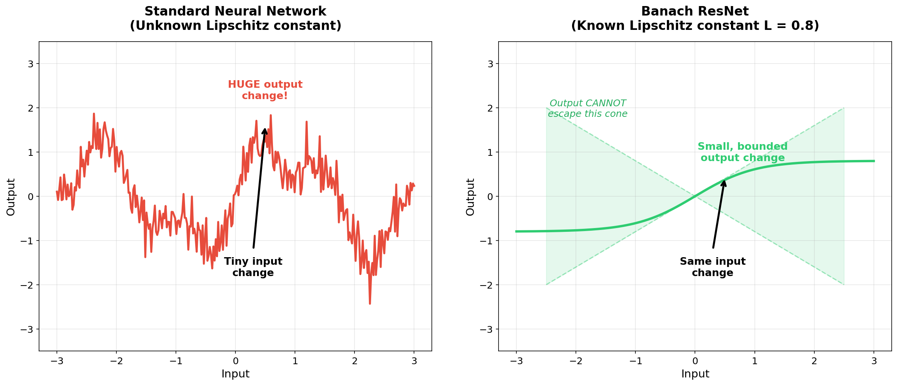
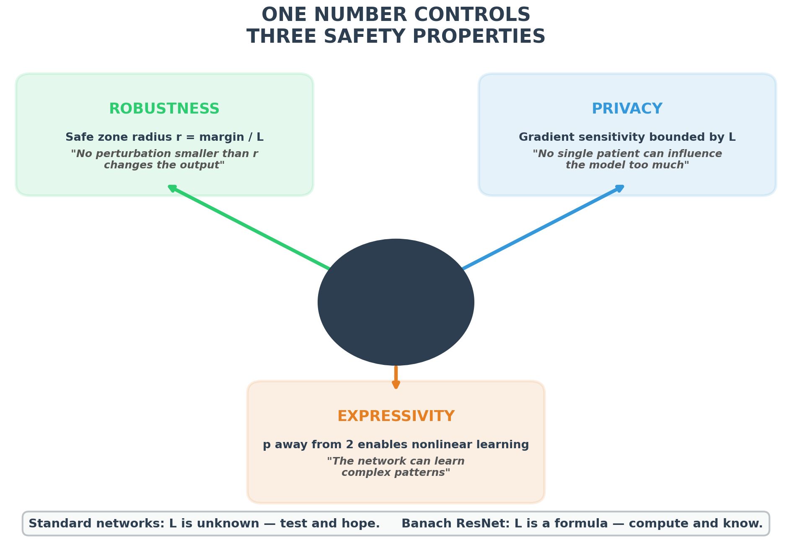

# BanachSafeAI

## Neural Networks with Built-In Safety Guarantees

A neural network architecture where **robustness**, **privacy**, and **expressivity** are mathematical consequences of a single design choice -- the geometry of l^p Banach spaces. Every prediction carries a **certified safety guarantee** computed exactly from the architecture's weights. No post-hoc testing. No empirical estimation.

---

### Quick Links

| Resource | Description | Link |
|----------|-------------|------|
| Project Explainer (2 min 37 sec) | Video overview of the architecture and safety certificates | <a href="video/banachsafeai_explainer.mp4" target="_blank">Watch</a> |
| Interactive Demo (Colab) | Runs in ~2 min on CPU, no installation needed | <a href="https://colab.research.google.com/drive/11xAXxd9RqQm0abBs7k6Y-FCFksoA6_lS?usp=sharing" target="_blank">Open in Colab</a> |
| MOABB Baseline Report (PDF) | Full LOSO comparison on real BCI data (9 subjects) | <a href="reports/banachsafeai_moabb_baseline_report.pdf" target="_blank">Read report</a> |

---

## 1. The Problem: AI Systems Have No Safety Proofs

AI systems deployed in safety-critical settings -- medical devices, brain-computer interfaces (BCIs, systems that decode neural signals to control devices such as wheelchairs and exoskeletons), clinical decision support -- are tested for safety **after** they are built. Companies run adversarial benchmarks, submit the results to regulators (MHRA, FDA, EU notified bodies), and hope for approval.

This approach has three fundamental limitations:

1. **You can only test attacks you have already thought of.** A new attack tomorrow could bypass every test you ran yesterday. Passing 1,000 tests provides no guarantee about the 1,001st.

2. **The developer chooses which tests to report.** The set of benchmarks is necessarily finite and selected by the submitter. A manufacturer can run many adversarial evaluations and report only those that passed. A mathematical certificate, by contrast, cannot be selectively reported -- it is a property of the architecture, not a choice of test suite.

3. **Testing provides no guarantee about the worst case.** Even if the system survives every test, there is no proof that it will behave correctly on an input it has never seen before.

What if, instead of testing the system and hoping, we could **prove mathematically** that it is safe?

That is what the Banach ResNet does.

---

## 2. The Key Idea: The Lipschitz Constant

Every neural network is a function: it takes an input (e.g., brain signals) and produces an output (e.g., "left hand"). The critical question is: **how sensitive is this function to small changes in the input?**

The **Lipschitz constant** L is a single number that answers this question:

> **If the input changes by at most delta, the output changes by at most L x delta.**
>
> No exceptions. No probabilities. A mathematical fact.

In standard neural networks, **nobody knows what L is**. It must be estimated by running experiments.

In the Banach ResNet, L is **computed exactly** from the architecture's weights:

> **L_p = product over all layers of (1 + eta_k x ||A_k||)**

Every term in this product is known. There is no approximation. Because each linear layer is spectrally normalised (||A_k|| <= 1), the Lipschitz constant simplifies to L_p = product of (1 + eta_k) in the experiments.



**Left:** A standard neural network can change its output dramatically in response to a tiny input change. There is no way to predict the worst case. **Right:** The Banach ResNet has a known Lipschitz constant. Its output is mathematically confined within a cone -- it cannot change faster than L times the input change.

---

## 3. One Computable Quantity Controls Three Safety Properties

To our knowledge, no other neural network architecture provides all three properties from a single computable quantity.



---

### Property 1: Robustness -- Every Prediction Has a Safe Zone

The certified radius **r = margin / L_p** defines a **safe zone** around each input. Any perturbation smaller than r -- electrode noise, session drift, movement artifacts -- is **mathematically guaranteed** not to change the prediction.

A standard neural network gives you a prediction and nothing else. The Banach ResNet gives you a prediction **and a guarantee**.


Each prediction has a certified safe zone (green circle). Any perturbation smaller than the radius r cannot change the output -- regardless of what kind of noise is added.

---

### Property 2: Privacy -- Patient Data Cannot Leak

The standard defence is **differential privacy (DP)**: clip every patient's gradient to a fixed maximum, then add noise. The problem: clipping distorts gradients and degrades accuracy. Most existing DP methods for neural network training are variants of this approach.

The Banach ResNet offers a principled alternative. The Lipschitz constant L_p provides **structurally bounded per-sample sensitivity**, offering a path to differentially private training without relying on heuristic clipping.


**Left:** In a standard network, one patient's data can produce an enormous gradient, requiring clipping (which distorts learning). **Right:** In the Banach ResNet, the Lipschitz bound offers structurally bounded per-sample sensitivity, providing a principled alternative to heuristic gradient clipping.

---

### Property 3: Expressivity -- The Network Can Actually Learn

The architecture is parameterised by a **geometry parameter p** that controls the shape of the activation function (the duality map):

> **J_p(z) = sign(z) x |z|^(p-1)**

At **p = 2** (standard Euclidean geometry), the duality map is the identity -- the network collapses expressivity entirely (linear function, useless for complex tasks). This is the **Hilbert degeneracy**, confirmed experimentally.

Moving **p away from 2** restores nonlinear computation. Cross-validation selects the operating point that balances accuracy against certification strength.


**Left (p=2):** The activation is the identity -- the network is linear. **Centre (p=3):** Nonlinear, with safety certificates (the sweet spot). **Right (p=1.5):** Sublinear, with strong privacy bounds but less expressivity.

---

## 4. The Architecture

Each residual layer applies the duality map as its activation function, with spectrally normalised weight matrices:

> **h_{k+1} = h_k - eta_k x J_p(A_k h_k + b_k)**

This is a step of mirror descent in l^p geometry. Spectral normalisation ensures the Lipschitz constant is computable in closed form.

| p value | Activation shape | Behaviour |
|---------|-----------------|-----------|
| p = 2 | Identity (linear) | Largest theoretical certificate but collapses expressivity |
| p = 3 | Quadratic | Nonlinear + certified bounds (best for BCI data) |
| p = 1.5 | Sublinear | Strong privacy bounds, less expressive |

---

## 5. Proof-of-Concept: Real BCI Data

Validated on the **BNCI2014-001** benchmark: 9 subjects, 22 EEG channels, 4-class motor imagery (left hand, right hand, feet, tongue).

**Geometry parameter sweep** (single fold: train S1-S8, test S9):

| Geometry (p) | Accuracy | Lipschitz L_p | Mean Certified Radius | Note |
|:---:|:---:|:---:|:---:|---|
| 1.2 | 42.9% | 4.2 | 0.1026 | |
| 1.5 | 44.6% | 21.0 | 0.0619 | |
| **2.0** | **39.1%** | **2.7** | **0.2225** | **Hilbert degeneracy (affine)** |
| **3.0** | **45.7%** | **11.35** | **0.0653** | **CV-selected best geometry** |
| 4.0 | 40.1% | 16.5 | 0.0764 | |

**Full leave-one-subject-out (LOSO) baseline comparison** (all 9 subjects as held-out test):

| Model | Mean Accuracy | Mean Cert. Radius | Note |
|---|:---:|:---:|---|
| Logistic Regression | 37.8% +/- 8.8% | --- | Linear baseline, no certificate |
| Standard ResNet (ReLU) | 30.2% +/- 5.3% | --- | Nonlinear baseline, no certificate |
| **Banach ResNet (p=3.0)** | **34.7% +/- 7.6%** | **0.034** | **Only model with any certificate** |

Single-subject evaluation (train S1-S8, test S9) achieves 45.7% at p=3.0. Full LOSO across all 9 subjects yields 34.7% +/- 7.6%, competitive with Standard ResNet (30.2%) and within 3 points of Logistic Regression (37.8%) -- the only model among the three that provides any robustness certificate. Logistic Regression leads on accuracy because log-bandpower features are nearly linear discriminants; the Banach ResNet's spectral normalisation acts as implicit regularisation, preventing the overfitting seen in the Standard ResNet.

For the full LOSO per-subject results, see the <a href="reports/banachsafeai_moabb_baseline_report.pdf" target="_blank">MOABB Baseline Report</a>.


**Panel 1:** Cross-validation selects p = 3.0. **Panel 2:** Test accuracy confirms the selection. **Panel 3:** Certified robustness radius. **Panel 4:** Lipschitz constant. The parameter p controls all four quantities simultaneously.

### Per-Prediction Certificates

Every single prediction (576 trials) carries its own robustness certificate.


**Green** bars: predictions with large safe zones (high confidence). **Orange** bars: marginal. **Red** bars: low confidence. **Black** bars: misclassified. A clinician can use this colour coding to decide which predictions to trust.

### Example Certificate (p = 3.0)

```
Prediction:              Left-hand motor imagery
Classification margin:   0.742
Lipschitz constant L_p:  11.35
Certified radius r:      0.065

This means: no input perturbation smaller than 0.065
can change this prediction. This is a mathematical proof.
```

---

## 6. What This Fellowship Will Produce


By the end of the fellowship, the deliverable will be a **pip-installable Python package** (`banachsafeai`) that allows any PyTorch model to produce deterministic robustness certificates for each prediction on BCI benchmarks.

**Month 3:**
- PyTorch BanachResNet layer with exact Lipschitz computation module
- MOABB evaluation script benchmarked on motor imagery and P300
- Comparison against LipNeXt and deel-lip

**Month 6:**
- Certified robustness benchmark suite
- Lipschitz-bounded DP-SGD training implementation
- `model.certify(x)` API returning robustness radius, privacy budget, expressivity check
- Full leave-one-subject-out cross-subject evaluation

**Month 12:**
- `pip install banachsafeai`
- 9+ BCI datasets benchmarked with 3 certified baselines reproduced
- Paper submitted (NeurIPS / ICML)
- One external domain validation collaborator identified

**Who will use this:**
- BCI researchers evaluating robustness of neural decoders
- Medical AI teams preparing regulatory submissions (MHRA, FDA, EU AI Act)
- Robustness researchers benchmarking certified models

---

## 7. From Toolkit to Regulatory Submission

The end product is not just a trained model -- it is a **certificate**: a document stating, for each prediction, the robustness radius, the privacy budget consumed, and the expressivity verification.


Today, companies submitting AI medical devices provide empirical test reports (adversarial attack results, stress tests). BanachSafeAI generates **mathematical proof** instead -- deterministic, per-prediction, auditable. This is the evidence that regulators are beginning to require. Existing certified methods rely on probabilistic smoothing or loose bounds; the Banach ResNet provides deterministic, closed-form certificates from the architecture itself.

### Why Now

Three regulatory frameworks converging in 2026 create immediate demand:

- **EU AI Act** Article 15 (enforcement August 2026): requires robustness evidence for high-risk AI
- **UK MHRA**: publishing new AI medical device framework in 2026
- **US FDA TPLC** (2025): demands lifecycle robustness evidence for AI-enabled medical devices

**Project status:** Research prototype. The proof-of-concept validates the core mechanism on public BCI benchmarks. The fellowship year is about engineering this into a reproducible, installable package with benchmark comparisons and external validation.

---

## 8. Interactive Demo

**Runs in ~2 minutes on CPU. No GPU required. No installation needed.**

<a href="https://colab.research.google.com/drive/11xAXxd9RqQm0abBs7k6Y-FCFksoA6_lS?usp=sharing" target="_blank">Open in Google Colab</a>

The notebook demonstrates:

1. The duality map activation function at different values of p
2. Training Banach ResNets at six geometry values
3. Baseline comparison: Logistic Regression vs Standard ResNet vs Banach ResNet on the same data
4. A per-prediction robustness certificate with certified radius, margin, and Lipschitz constant
5. The p-sweep showing how one computable quantity controls accuracy, robustness, and Lipschitz bound
6. Per-prediction certificate visualisation colour-coded by confidence
7. The Hilbert degeneracy at p = 2 confirmed experimentally

To run: open the link, click **Runtime** then **Run all**. All outputs are pre-rendered -- the notebook functions as a visual document even without execution.

---

## 9. Project Explainer Video

A 2 minute 37 second overview of the project, the architecture, and the safety certificate framework.

<a href="video/banachsafeai_explainer.mp4" target="_blank">Watch the explainer</a>

---

## 10. Summary

|  | Standard Neural Networks | Banach ResNet |
|---|---|---|
| **Robustness** | Test with known attacks, hope for the best | Mathematical proof: certified radius per prediction |
| **Privacy** | Clip gradients (distorts learning) | Structurally bounded sensitivity (principled alternative to clipping) |
| **Expressivity** | Unknown relationship to safety | Controlled by geometry parameter p |
| **Lipschitz constant** | Unknown | Computed exactly from weights |
| **Regulatory evidence** | Empirical test reports | Mathematical certificates |

---

**One architecture. One computable quantity. Three safety guarantees. Zero post-hoc testing.**

---

## Contact

K. S. Sesh Kumar

Brevan Howard Centre for Financial Analysis, Imperial Business School

Homepage: <a href="https://seshkumar.github.io/" target="_blank">seshkumar.github.io</a>
